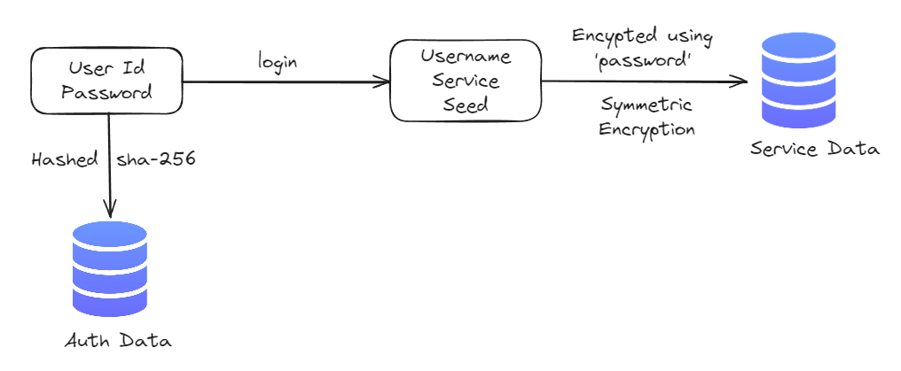

# vAUTH

**vAUTH** v0.0.1! This 2FA command-line tool is designed to help you manage your accounts and services through Time-based One-Time Passwords (TOTP). You can register, login, recover accounts, and manage services with ease. It also includes a built-in shell to interact with your services securely and efficiently.

## Table of Contents

- [Encrytption](#encryption)
- [Features](#features)
- [Installation](#installation)
- [Usage](#usage)
  - [Registering a User](#registering-a-user)
  - [Logging In](#logging-in)
  - [Recovering an Account](#recovering-an-account)
  - [Removing an Account](#removing-an-account)
  - [Shell Commands](#shell-commands)
    - [Add Service](#add-service)
    - [Show Service](#show-service)
    - [Show QR Code](#show-qr-code)
    - [Remove Service](#remove-service)
    - [Modify Service](#modify-service)
    - [Quit](#quit)
- [Keyboard Shortcuts](#keyboard-shortcuts)
- [License](#license)

## Encryption



## Features

- **User Authentication**: Register, login, recover, and remove users.
- **Service Management**: Add, modify, remove services and generate Time-based OTPs.
- **TOTP Integration**: Use a TOTP app like Google Authenticator with QR codes.
- **Shell Interface**: Interactive shell for easy service management.
- **Real-Time OTP Display**: Continuously display OTPs with time remaining until refresh.

## Installation

Clone the repository and install the dependencies:

```bash
pip install vauth
```

## Usage

The vAUTH CLI supports a variety of commands for user and service management. After installation, you can start using the tool with the following commands.

### Registering a User

To register a new user:

```bash
vauth register -u <user_id>
```

You will receive confirmation and recovery codes upon successful registration.

### Logging In

To log in to the vAUTH CLI tool:

```bash
vauth login -u <user_id>
```

This will start an interactive shell where you can manage your services.

### Recovering an Account

If you need to recover your account:

```bash
vauth recover -u <user_id>
```

### Removing an Account

To remove a user account:

```bash
vauth remove -u <user_id>
```

### Shell Commands

Once you're logged in, the vAUTH Shell will allow you to interact with your services. Here are the available commands:

#### Add Service

```bash
add_service <service> <username> <seed>
```

Adds a new service with the specified username and seed.

#### Show Service

```bash
show_service <service> <username>
```

Displays the current OTP for the service along with the time remaining. It will also continuously update the OTP every 30 seconds until you press 'q' to quit. Here's how the output will look:

```bash
Service: <service_name>
Username: <username>
OTP: <current_otp>
█████████████████████████████░░27s
Press 'q' to quit
```

#### Show QR Code

```bash
show_qr <service> <username>
```

Displays a QR code for a service, which can be scanned using a TOTP app like Google Authenticator. It shows the service, username, and an ASCII QR code for easy scanning.

#### Remove Service

```bash
remove_service <service> <username>
```

Removes the specified service from your account.

#### Modify Service

```bash
modify_service <service> <username> <'username'/'seed'> <new_value>
```

Allows you to modify either the username or the seed of a service. You can specify whether you want to update the `username` or the `seed` and provide the new value.

#### Quit

You can quit the shell at any time by entering:

```bash
q
```

### Keyboard Shortcuts

- **q**: Quit the OTP display or exit the shell.

## Example Session

Here's a sample session of how the tool works:

1. **Register a User:**

   ```bash
   vauth register -u user123
   ```

   Output:

   ```bash
   vAUTH> Registration Successful
   Recovery Codes: ['ABCD1234', 'WXYZ5678', ...]
   ```

2. **Login and Use the Shell:**

   ```bash
   vauth login -u user123
   ```

   This will drop you into the interactive shell:

   ```bash
               $$$$$$\  $$\   $$\ $$$$$$$$\ $$\   $$\ 
              $$  __$$\ $$ |  $$ |\__$$  __|$$ |  $$ |
   $$\    $$\ $$ /  $$ |$$ |  $$ |   $$ |   $$ |  $$ |
   \$$\  $$  |$$$$$$$$ |$$ |  $$ |   $$ |   $$$$$$$$ |
    \$$\$$  / $$  __$$ |$$ |  $$ |   $$ |   $$  __$$ |
     \$$$  /  $$ |  $$ |$$ |  $$ |   $$ |   $$ |  $$ |
      \$  /   $$ |  $$ |\$$$$$$  |   $$ |   $$ |  $$ |
       \_/    \__|  \__| \______/    \__|   \__|  \__|


   Welcome to vAUTH CLI TOOL v1.0. Enter q to quit at any time.
   ```

3. **Add a Service:**

   ```bash
   vAUTH> add_service Google user123 ABCDEF123456
   ```

4. **Show OTP for a Service:**

   ```bash
   vAUTH> show_service Google user123
   ```

   Output:

   ```bash
   Service: Google
   Username: user123
   OTP: 123456
   ████████████████████████████░ 5s
   Press 'q' to quit
   ```

5. **Quit the Shell:**

   ```bash
   vAUTH> q
   ```

## License

This project is licensed under the MIT License - see the [LICENSE](LICENSE) file for details.
